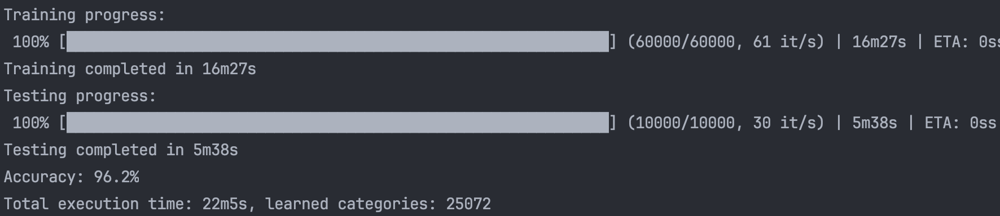

# Fuzzy ART

This is a highly optimized implementation of the Fuzzy ART algorithm, part of the Adaptive Resonance Theory (ART) family developed by Stephen Grossberg and Gail Carpenter.

There is an entire family of neural network models based on the principles of adaptive resonance theory (ART) used for pattern recognition and prediction.

The _Fuzzy ART_ algorithm features:
- **_Unsupervised_** efficient learning (a single pass is sufficient)
- **_Explainable_** results
- Stable **_On-line learning_** (incremental), no need to retrain from scratch, can learn incrementally and infer simultaneously
- **_No catastrophic forgetting_**

## Why Go?
All the Python implementations I found require approximately 4 hours and 30 minutes to complete a training session on the full MNIST dataset, even in single thread this code takes an hour less.

>_**This implementation completes a training on the full MNIST dataset in 16 minutes on a MacBook Pro M1 Pro and in less than 9 minutes on a 48-thread Xeon.**_

MacBook Pro M1 Pro: 10 cores, 16 threads, 16GB RAM:



## How?

It utilizes a worker pool the size of the available threads to parallelize the training process, plus a pool of pre-allocated slices that are rotated and reused at every iteration.

Further optimization may be possible. A detailed profiling of the code might be conducted in the future, but for now, the results are satisfactory.

## Usage

Download the MNIST dataset using this makefile target, which will download the training and test sets in the example folder:
```bash
make get-mnist
```

The MNIST dataset contains 60000 samples, open the `example/main.go` file and edit the following constants to test just a subset of the dataset or leave them to -1 to run the complete dataset.

```
TRAIN_SAMPLES_PER_DIGIT = -1
TEST_SAMPLES_PER_DIGIT = -1
```

Now run the following command: 
```bash
make run-example
```

## Adaptive Resonance Theory

Adaptive Resonance Theory, or ART, is a cognitive and neural theory of how the brain autonomously learns to categorize, recognize, and predict objects and events in a changing world pioneered by Stephen Grossberg and Gail Carpenter.
You can read all about it in this paper [here](https://www.semanticscholar.org/paper/Adaptive-Resonance-Theory%3A-How-a-brain-learns-to-a-Grossberg/71bc18bcafe1f4909a97b0b17a522dffe306ee6a?p2df).
